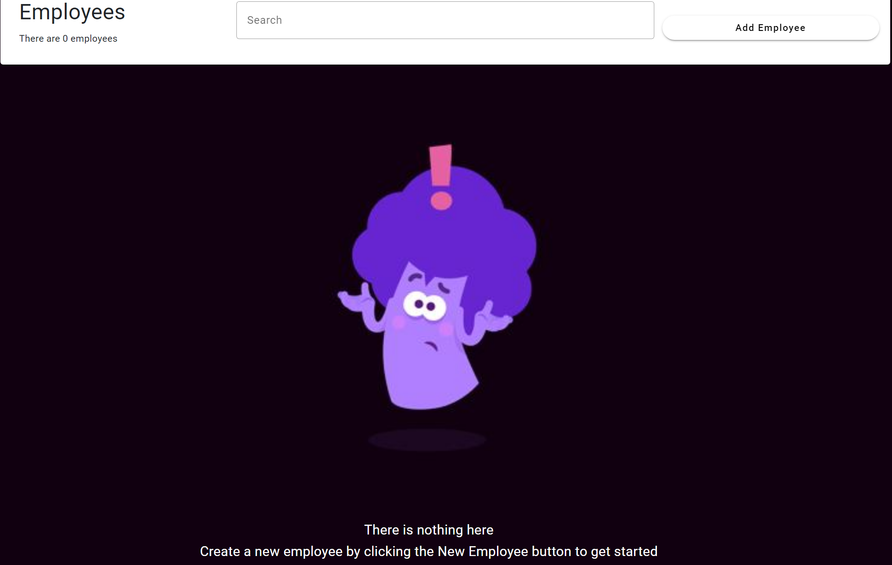

Tangent Assessment v1.0

This is a brief of how the Employee API works along with the UI shown.
The following screenshots and explanations are found below:

1.  Opening Page

    a.  The employee list which is collected from the GetEmployees API
        is shown here.

> {width="4.856548556430446in"
> height="2.3863057742782154in"}

b.  The top section contains the following: An indicator that shows how
    many employees are fetched from the API, The search bar that can be
    used to search for employees by name, surname and email address, and
    the Add Employee button to open a new form to create a new employee.

> {width="5.306073928258968in"
> height="1.7059864391951005in"}

c.  In the event there's no employees retrieved from the API, the
    following screen will appear
    {width="4.929110892388452in"
    height="3.128614391951006in"}

2.  Employee Form

    a.  The form is the component used to create and edit new employees.
        Validations for each field are applied. Skills for employees can
        be added and removed during the process

> {width="3.5398873578302714in"
> height="3.3998764216972877in"}
>
> {width="5.0419280402449695in"
> height="3.1963123359580052in"}

b.  Clicking on an entry in the employee list will open the employee
    form with a view to edit

> {width="4.8655424321959755in"
> height="2.4979965004374454in"}
